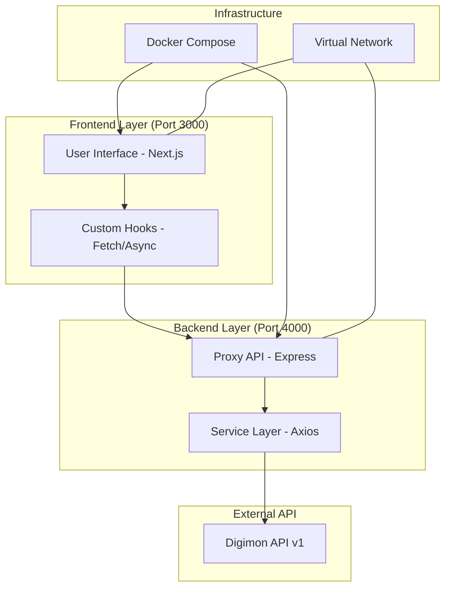

# Arquitectura del Sistema - Digimon SOA

Este documento detalla el diseño de la **Arquitectura Orientada a Servicios (SOA)** implementada para la exposición y consumo de la Digimon API.

## Diagrama de Arquitectura

## Justificación Técnica

La arquitectura se diseñó bajo el principio de **desacoplamiento estricto**, cumpliendo con los requisitos de la actividad ACT6-C2:

1.  **Independencia de Repositorios:** El Frontend, el Backend y la Infraestructura residen en carpetas separadas que pueden ser gestionadas como repositorios independientes.
2.  **Capa de Proxy:** El Backend actúa como un mediador que protege al cliente de llamadas directas a APIs de terceros, permitiendo agregar lógica de seguridad, caché o transformación de datos en el futuro.
3.  **Aislamiento de Entorno:** Mediante Docker, cada capa corre en su propio contenedor con puertos aislados, comunicándose a través de una red virtual interna.
4.  **Manejo Asíncrono:** Toda la comunicación entre capas utiliza `async/await`, garantizando que la UI no se bloquee mientras espera respuestas.
5.  **Separación de Responsabilidades:**
    *   **Frontend:** Solo visualización y estado de UI.
    *   **Backend:** Lógica de negocio y conectividad externa.
    *   **Infraestructura:** Orquestación y despliegue.
